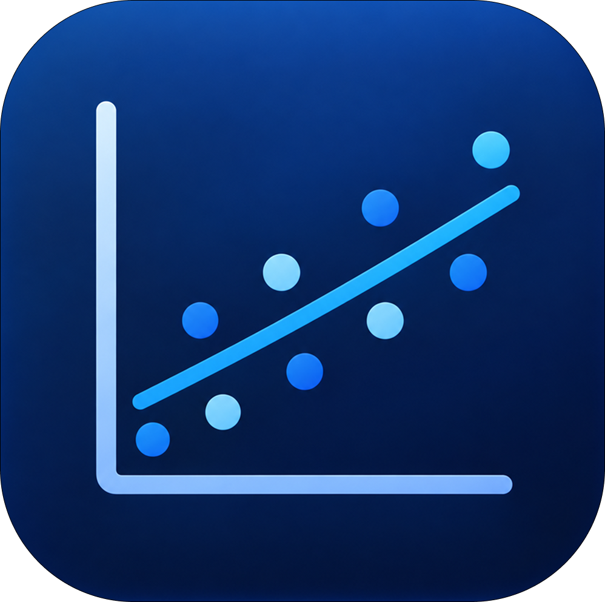
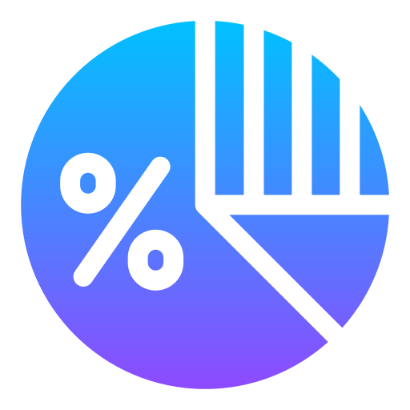

  <h1>Hello, I'm Orkun.</h1>
  
<strong>Data Scientist</strong>

  
I transform data into meaningful insights and insights into actionable products.

  
Bursa Technical University · Data Science and Analytics

 

  <strong>Who am I?</strong> 
  I am studying Data Science and Analytics at Bursa Technical University. I enjoy making complex datasets meaningful, transforming ambiguous problems into measurable questions, and producing reliable results from data.

  <strong>What do I do?</strong> 
  I work on machine learning, time series analysis, and data visualization projects. I go beyond keeping my models in analytical environments by transforming them into interactive data products using Next.js, React, FastAPI, Streamlit, and Supabase.

  From data cleaning and exploration to model development, API design, and presenting results through user-friendly interfaces, I take part in the end-to-end development process. My goal is to build technically robust, understandable, and real-world applicable solutions.

 

 

  <h2>Selected Work</h2>
  

    Projects that reflect how I approach data, analysis, and product development.
  

 

<table align="center" width="100%">

<tr>

<td width="50%" align="center" valign="top">

 

  

### [Kampusfer](https://github.com/orkunerylmz/Kampusfer)

Campus Marketplace

 

A campus-focused marketplace designed for 
verified university students, combining listings, 
authentication, filtering, and real-time interactions.

 

  <code>Next.js</code>
  <code>React</code>
  <code>Supabase</code>

  

  <a href="https://github.com/orkunerylmz/Kampusfer">
    View Repository →
  </a>

 

</td>

<td width="50%" align="center" valign="top">

 

  

### [StatReg](https://github.com/orkunerylmz/StatReg)

Statistical Analysis

 

A desktop pplication designed for regression 
analysis, statistical exploration, model comparison 
and accessible analytical workflows.

 

  <code>Python</code>
  <code>PyQt6</code>
  <code>Regression</code>

  

  <a href="https://github.com/orkunerylmz/StatReg">
    View Repository →
  </a>

 

</td>

</tr>

<tr>

<td width="50%" align="center" valign="top">

 

  

### [Grafiker](https://github.com/orkunerylmz/Grafiker)

Data Visualization

 

A desktop application designed to transform 
datasets into clear, interpretable visualizations 
for faster exploration and understanding.

 

  <code>Python</code>
  <code>Visualization</code>
  <code>Desktop</code>

  

  <a href="https://github.com/orkunerylmz/Grafiker">
    View Repository →
  </a>

 

</td>

<td width="50%" align="center" valign="top">

 

  

### [Target](https://github.com/orkunerylmz/Target)

Financial Data Product

 

A native desktop application designed for financial 
goal tracking, savings planning, progress analysis, 
and interactive scenario simulations.

 

  <code>React</code>
  <code>Tauri</code>
  <code>Rust</code>

  

  <a href="https://github.com/orkunerylmz/Target">
    View Repository →
  </a>

 

</td>

</tr>

</table>

 

  Turning analytical ideas into clear, usable products.

---

<h2 align="center">Contact</h2>

  
<i>Feel free to connect with me for data-driven projects, new ideas, and collaborations.</i>

  &nbsp;&nbsp;&nbsp;
  &nbsp;&nbsp;&nbsp;
  

---

<h2 align="center">My Technology Stack</h2>

  <h3 align="center">Programming</h3>
  

  

    &nbsp;&nbsp;
    
  

  <h3 align="center">Data Science & Machine Learning</h3>
  

  

    &nbsp;&nbsp;
    &nbsp;&nbsp;
    &nbsp;&nbsp;
    
  

  <h3 align="center">Frontend & Application Development</h3>
  

  

    &nbsp;&nbsp;
    &nbsp;&nbsp;
    
  

  <h3 align="center">Database, API & DevOps</h3>
  

  

    &nbsp;&nbsp;
    &nbsp;&nbsp;
    &nbsp;&nbsp;
    
      
    &nbsp;&nbsp;
    &nbsp;&nbsp;
    &nbsp;&nbsp;
    
  

---

<h2 align="center">GitHub Statistics</h2>

  

    

  
  &nbsp;&nbsp;
  

    

  
  &nbsp;&nbsp;
  

    

---

<h2 align="center">Contribution Snake</h2>

  <picture>
    <source media="(prefers-color-scheme: dark)" srcset="https://raw.githubusercontent.com/orkunerylmz/orkunerylmz/output/github-snake-dark.svg" />
    <source media="(prefers-color-scheme: light)" srcset="https://raw.githubusercontent.com/orkunerylmz/orkunerylmz/output/github-snake.svg" />
    
  </picture>

